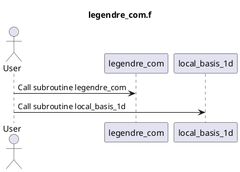

# Code Review: legendre_com

## Summary

The `legendre_com.f` file contains two subroutines: `legendre_com` and `local_basis_1D`. 

The `legendre_com` subroutine computes the abscissas and weights for Gauss-Legendre quadrature. It approximates the integral of a function over the interval [-1, 1] using a sum of weighted function evaluations at specific abscissas. The abscissas and weights are stored in the `xtab` and `weight` arrays, respectively. This subroutine is based on the algorithm described in the comments at the beginning of the code.

The `local_basis_1d` subroutine evaluates the basis functions in an element. This subroutine calculates the values of the basis functions for a given set of nodes and a point `x` inside the element. The basis functions are multiplied with each other, excluding the basis function corresponding to the given node, and then normalized by dividing by the difference between the node positions. The resulting values are stored in the `phi` array.

## Parameters

### legendre_com Subroutine

- `norder` (input, integer): The order of the Gauss-Legendre quadrature rule. It must be greater than 0.

- `xtab` (output, double precision array): The abscissas of the Gauss-Legendre quadrature rule. It has a dimension of `norder`.

- `weight` (output, double precision array): The weights of the Gauss-Legendre quadrature rule. They are positive, symmetric, and should sum to 2. It has a dimension of `norder`.

### local_basis_1d Subroutine

- `order` (input, integer): The number of nodes defining the basis functions.

- `node_x` (input, double precision array): The positions of the nodes defining the basis functions. It has a dimension of `order`.

- `x` (input, double precision): The point inside the element at which the basis functions are evaluated.

- `phi` (output, double precision array): The values of the basis functions evaluated at the point `x`. It has a dimension of `order`.

## Algorithm Implementation

The `legendre_com` subroutine uses a modified version of the Gauss-Legendre quadrature algorithm to compute the abscissas and weights. The algorithm computes the abscissas and weights iteratively by successively refining an initial approximation. The abscissas and weights are then stored in the `xtab` and `weight` arrays.

The `local_basis_1d` subroutine evaluates the basis functions for a given set of nodes and a point `x` inside the element. It computes the values of the basis functions using a product formula and normalization. The values are stored in the `phi` array.

## UML Diagram

## Code Quality

The code follows the Fortran 77 syntax and conventions. The variable names are descriptive and meaningful. The code is well-commented, providing information about the purpose and functionality of each subroutine.

However, there are a few areas of improvement:

- The use of integer variables to perform floating-point calculations can cause loss of precision. It would be better to declare variables `e1`, `d1`, `d2pn`, `d3pn`, and `d4pn` as double precision by adding the `kind = 8` attribute.

- The code lacks the use of structured programming techniques such as functions and modules. Organizing the code into separate functions and modules would enhance readability, modularity, and reusability.

- The code does not handle potential exceptions or errors gracefully. For example, when the input `norder` is less than 1, the code performs a `STOP` statement without providing any explanation or alternative actions.

- The code could benefit from further code documentation, such as explaining the purpose of each subroutine and providing code examples.

- The code does not include any input validation or error-checking, such as ensuring that the size of arrays matches the expected values or handling of potential division by zero errors.

Overall, the code provides a functional implementation of the Gauss-Legendre quadrature and local basis evaluation algorithms, but there is room for improvement in terms of readability, modularity, error handling, and documentation.