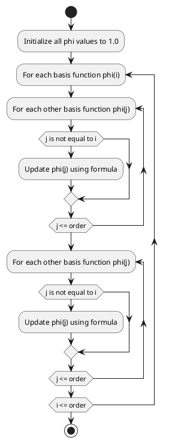

# Code Review: local_basis_1d

## Summary

The "local_basis_1d" file contains two Fortran 77 subroutines. The first subroutine, "local_basis_1d", evaluates the basis functions for a given point in an element. The second subroutine, "local_basis_prime_1d", evaluates the derivatives of the basis functions in an element.

## Parameters

### local_basis_1d

- `order` (integer): The order of the element. Determines the number of basis functions to evaluate.
- `node_x` (double precision array): The element nodes. Must be distinct. Each element of `node_x` represents the x-coordinate of a node in the element.
- `x` (double precision): The point at which the basis functions are to be evaluated.
- `phi` (double precision array): Output array to store the resulting basis functions.

### local_basis_prime_1d

- `order` (integer): The order of the element. Determines the number of basis functions to evaluate.
- `node_x` (double precision array): The element nodes. Must be distinct. Each element of `node_x` represents the x-coordinate of a node in the element.
- `x` (double precision): The point at which the basis function derivatives are to be evaluated.
- `dphidx` (double precision array): Output array to store the resulting basis function derivatives.

## Algorithm Implementation

### local_basis_1d
The algorithm for evaluating the basis functions in an element proceeds as follows:

1. Initialize all elements of the `phi` array to 1.0.
2. For each basis function `phi(i)`:
   - For each other basis function `phi(j)`:
     - If `j` is not equal to `i`, update `phi(j)` using the formula: `phi(j) = (phi(j) * (x - node_x(i))) / (node_x(j) - node_x(i))`
3. Return the `phi` array containing the basis function values.

### local_basis_prime_1d
The algorithm for evaluating the derivatives of the basis functions in an element is similar to the algorithm for evaluating the basis functions. It proceeds as follows:

1. Initialize all elements of the `phi` array to 1.0.
2. For each basis function `phi(i)`:
   - For each other basis function `phi(j)`:
     - If `j` is not equal to `i`, update `phi(j)` using the formula: `phi(j) = (phi(j) * (x - node_x(i))) / (node_x(j) - node_x(i))`
3. Return the `phi` array containing the basis function derivative values.

## UML Diagram

## Code Quality

The code follows Fortran 77 syntax and conventions. Here are some observations:

- The code is well-documented with comments explaining the purpose, inputs, and outputs of each subroutine.
- Variable names are descriptive and provide some context for their purpose.
- The code uses a simple nested loop structure to evaluate the basis functions and their derivatives.
- The code could benefit from additional error handling and input validation, such as checking for valid `order` values and distinct `node_x` values.
- The code does not take advantage of modern Fortran features and could be updated to utilize more recent versions of the language.

Overall, the code is clear and easy to understand, but could benefit from some enhancements to improve robustness and maintainability.