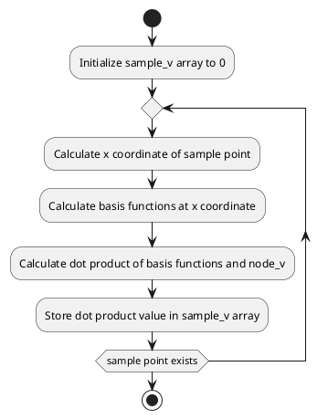

# Code Review: local_fem_1d

## Summary

The code in the "local_fem_1d" file implements a subroutine that computes the values of local finite element basis functions for a 1-dimensional problem. The basis functions are evaluated at given sample points. The subroutine takes in several parameters such as the order of the element, the element nodes, the values of the finite element function at each node, the number of sample points, and the sample points at which the local finite element function is to be evaluated. The subroutine returns the values of the local finite element basis functions at the sample points.

## Parameters

The core parameters defined in the file are:

1. `order` (integer): The order of the element. This parameter determines the complexity of the basis functions. An order of 0 represents piecewise constant elements, and higher orders represent higher-degree polynomial elements.

2. `sample_num` (integer): The number of sample points. This parameter specifies the number of points at which the local finite element basis functions will be evaluated.

3. `node_x` (array of double precision): The element nodes. This array contains the distinct coordinates of the nodes for the element. Each node is associated with a basis function.

4. `node_v` (array of double precision): The value of the finite element function at each node. This array contains the values of the finite element function evaluated at each node of the element.

5. `sample_x` (array of double precision): The sample points at which the local finite element basis functions are to be evaluated. This array contains the coordinates of the sample points.

6. `sample_v` (array of double precision): The values of the local finite element basis functions. This array stores the computed values of the local finite element basis functions at the sample points.

## Algorithm Implementation

The algorithm implemented in this code follows a simple procedure to compute the values of the local finite element basis functions. A loop is used to iterate over each sample point. For each sample point, the routine computes the basis functions at that point using the `local_basis_1d` subroutine. Then, the dot product of the basis functions and the finite element function values at the nodes is calculated using the `r8vec_dot_product` function. The resulting value is stored in the `sample_v` array. By performing these steps for all sample points, the values of the local finite element basis functions are obtained.

## UML Diagram

## Code Quality

The code appears to be well-written and follows good coding practices. Here are some positive aspects of the code:

1. The code uses self-explanatory variable names, making it easier to understand the purpose of each variable.

2. The code follows a modular approach by using subroutines and functions to encapsulate logical components of the algorithm. This enhances code reusability and maintainability.

3. The code includes comments explaining the purpose and usage of each parameter, as well as the overall structure of the algorithm.

4. The code initializes the `sample_v` array to 0 before using it, ensuring consistent behavior and avoiding any potential issues with uninitialized memory.

One potential improvement for the code is to include safeguards to handle invalid input. For example, the code assumes that the `order` parameter is non-negative, but there is no explicit check for that. It would be helpful to add a check and handle such cases gracefully by raising an appropriate error or returning an error code.

Overall, the code is well-structured and readable, which facilitates understanding and maintenance.