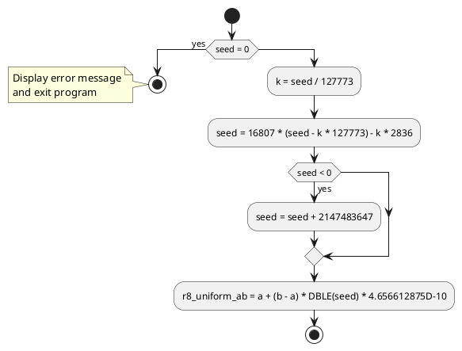

# Code Review: r8_uniform_ab

## Summary

The file "r8_uniform_ab" contains a Fortran 77 subroutine that generates a random number between the given limits of an interval. The subroutine takes in the input limits A and B, as well as the input/output seed value and updates the seed value. The output is a random number strictly between A and B.

## Parameters

- `a` (DOUBLE PRECISION): Input parameter representing the lower limit of the interval.
- `b` (DOUBLE PRECISION): Input parameter representing the upper limit of the interval.
- `seed` (INTEGER): Input/output parameter representing the seed value for the random number generator. It is updated within the subroutine.
- `r8_uniform_ab` (DOUBLE PRECISION): Output parameter that represents the generated random number strictly between A and B.

## Algorithm Implementation

The algorithm implemented in this subroutine is a linear congruential random number generator. The algorithm follows these steps:

1. Check if the seed value is 0. If so, it displays an error message and exits the program.
2. Compute the value `k` as the integer division of the seed by 127773.
3. Update the seed value using the formula `seed = 16807 * (seed - k * 127773) - k * 2836`.
4. If the new seed value is less than 0, add 2147483647 to it.
5. Compute the random number as `r8_uniform_ab = a + (b - a) * DBLE(seed) * 4.656612875D-10`.
6. Return the computed random number.

## UML Diagram

## Code Quality

The code follows Fortran 77 syntax and conventions. Here are some observations regarding code quality:

- Readability: The code is easy to read and understand, thanks to good variable naming and comments.
- Error handling: The code checks if the seed value is 0 and displays an error message if so. This ensures that the random number generator is not misused.
- Portability: The code uses only Fortran 77 constructs, making it easily portable to different Fortran compilers.
- Magic numbers: The code contains some magic numbers (e.g., 127773, 16807). It would be more readable to define these numbers as named constants for better code maintainability.

Overall, the code is well-written, concise, and implements a standard method for generating random numbers within a given interval.