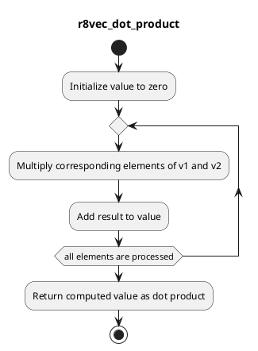

# Code Review: r8vec_dot_product

## Summary
The code is a Fortran 77 function that calculates the dot product between two vectors of type `double precision`. The dot product is a scalar value that represents the geometric relationship between two vectors.

## Parameters
The code defines the following core parameters:
- `n` (integer): The dimension of the vectors.
- `v1` (double precision array): The first input vector of length `n`.
- `v2` (double precision array): The second input vector of length `n`.

## Algorithm Implementation
The algorithm for calculating the dot product is straightforward. It initializes a variable `value` to zero and then iterates over the elements of the input vectors using a loop. Inside the loop, it multiplies the corresponding elements of the vectors and adds the result to `value`. Finally, it returns the computed dot product.

## UML Diagram

## Code Quality
The provided code is relatively simple and follows standard Fortran 77 syntax and conventions. However, there are a few areas that could be improved:
- The code lacks comments and documentation, which makes it difficult to understand without prior knowledge of dot products in linear algebra.
- The code does not perform any input validation or error handling, such as checking the compatibility of the vector dimensions.
- The array declarations should specify the size of the arrays explicitly, using a constant or a parameter, rather than using the undefined variable `n` as the size.

Overall, the code is functional and performs the desired calculation correctly, but it could benefit from better clarity and robustness.

## Questions/Comments
- Is the undefined variable `n` intended for the size of the input vectors? If so, how is it expected to be defined and passed into the function?
- Do you have any specific requirements or constraints for the code that I should consider in the review process?