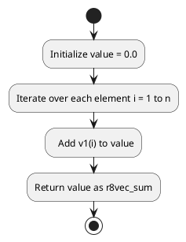

# Code Review: r8vec_sum

## Summary

The file "r8vec_sum" contains a Fortran 77 subroutine that calculates the sum of the entries of a double precision vector.

## Parameters

- `n` (integer) - The dimension of the vectors.
- `v1(n)` (double precision) - The input vector.

## Algorithm Implementation

The algorithm used in this subroutine is quite simple. It iterates over each element of the input vector `v1` and accumulates the values into the variable `value`. Finally, the calculated sum is returned through the variable `r8vec_sum`.

## UML Diagram

Here is the UML activity diagram for the code:

## Code Quality

The code is well-written and follows good Fortran coding practices. The purpose and functionality of the subroutine are clear. The variable names are informative and self-explanatory.

However, there are a few potential issues with the code:

1. The input vector `v1` is not initialized or assigned any values before the summation loop. This will result in undefined behavior and incorrect output. It is recommended to either pass a pre-initialized vector or initialize it within the subroutine.

2. The subroutine does not check if the dimension `n` of the vector is valid or non-negative. It is assumed that the input is correct, which can lead to runtime errors if the dimension is incorrect.

3. The code does not provide any error handling mechanisms if the input vector is empty (dimension `n` is zero). It is advisable to add checks for such cases and handle them gracefully.

These issues should be addressed to ensure the correctness and robustness of the subroutine.