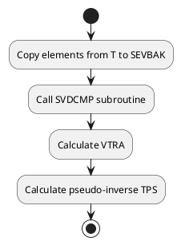

# Code Review: PS_SVD_1

## Summary

The file "PS_SVD_1" contains a Fortran 77 subroutine that calculates the pseudo-inverse solution of a given matrix using the Singular Value Decomposition (SVD) method. The pseudo-inverse solution is stored in the TPS array.

## Parameters

- `LARGE`: An array of length 1, representing a flag variable.
- `T`: A 2D array (NM x NKN) representing the original matrix.
- `TPS`: A 2D array (NKN x NM) representing the pseudo-inverse of the original matrix.
- `SEVBAK`: A 2D array (NM x NKN) used as a temporary matrix to store the copy of the sensitivity matrix.
- `VTRA`: A 2D array (NKN x NKN) used to store the matrix obtained from the SVD algorithm.
- `DIAGV`: A 1D array (NKN) used to store the singular values obtained from the SVD algorithm.
- `RV1`: A 1D array (NM) used as a workspace array.
- `CEREP`: An allocatable array used to store the results.
- `NM`: An integer representing the number of rows in the matrix.
- `NKN`: An integer representing the number of columns in the matrix.

## Algorithm Implementation

1. The subroutine first initializes the `SEVBAK` matrix by copying the elements from the `T` matrix.
2. Then, it calls the `SVDCMP` subroutine to perform the Singular Value Decomposition algorithm on the `SEVBAK` matrix. This algorithm decomposes the matrix into three matrices: `U`, `W`, and `V`, such that `SEVBAK = U * W * V^T`, where `U` and `V` are orthogonal matrices and `W` is a diagonal matrix containing the singular values.
3. Some of the singular values in the `DIAGV` array are set to zero if they are smaller than a threshold value (`SINMIN = SINMAX * 1.0E-6`).
4. The `VTRA` matrix is calculated by dividing each element by the corresponding non-zero singular value in the `DIAGV` array.
5. Finally, the `TPS` matrix is calculated by multiplying `VTRA`, `(1/DIAGV)`, and the transpose of the `SEVBAK` matrix.

## UML Diagram

The UML activity diagram below illustrates the workflow and structure of the code:

## Code Quality

Overall, the code seems to be well-written and follows the Fortran 77 standard. However, there are a few areas that could be improved:

1. Variable names could be more descriptive to enhance code readability.
2. The code lacks proper indentation and comments, which could make it more difficult to understand for someone not familiar with the code.

It is worth noting that Fortran 77 is an older programming language, and certain coding conventions and practices have evolved since its inception. It might be beneficial to consider migrating the code to a more modern version of Fortran or another programming language if possible.

Please let me know if you have any questions or if there are any specific aspects of the code that you would like me to review in more detail.