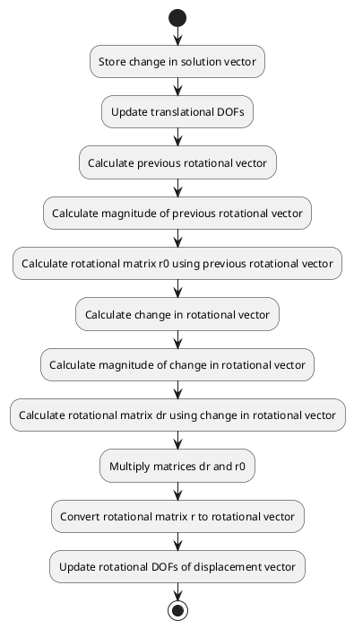

# Code Review: addshell

## Summary

The "addshell" subroutine is used to update the translational and rotational degrees of freedom for true shells. It adds translational DOFs directly, while for rotational DOFs, it transforms the rotational vectors into a rotational matrix, multiplies it with another matrix, and reverts it into a vector.

## Parameters

- `nactdof`: A 2D array that stores the active degrees of freedom (DOFs) for each node. The active DOFs are used to determine the indices in the solution vector `b` that correspond to each DOF.
- `node`: An integer representing the node index.
- `b`: A 1D array representing the solution vector.
- `mi`: A 1D array containing information about the model.
- `iperturb`: A 1D array indicating if perturbations are applied to the problem.
- `nmethod`: An integer indicating the solution method.
- `cam`: A 1D array used to store the change in the solution.
- `v`: A 2D array representing the displacement vector.

## Algorithm Implementation

The algorithm implemented in the "addshell" subroutine can be summarized as follows:

1. Store the change in solution vector `b` in the `bnac` array.
2. Update the translational DOFs by adding the corresponding entries of `bnac` to the displacement vector `v`.
3. Calculate the previous rotational vector and find its magnitude `ww`.
4. Calculate the rotational matrix `r0` using the previous rotational vector.
5. Repeat steps 3-4 for the change in rotational vector.
6. Multiply the matrices `dr` and `r0` and store the result in `r`.
7. Convert the rotational matrix `r` into a rotational vector using inverse formulas.
8. Update the rotational DOFs of the displacement vector `v` with the calculated rotational vector.

## UML Diagram

Below is a UML activity diagram representing the workflow and structure of the code:

## Code Quality

The code appears to be well-written and structured. The subroutine efficiently updates the translational and rotational DOFs for true shells. However, there are a few areas that can be improved for better code maintainability:

1. Magic numbers: The code contains some numeric values (e.g., `1.D-10`, `1.D-5`) that are not self-explanatory. It would be beneficial to define these values as named constants for better readability and easier modification.
2. Use of implicit types: The code uses implicit typing to define variables, which can lead to potential errors and difficulties in code maintenance. It would be better to explicitly declare the type of each variable.
3. Lack of comments: Although the code includes some inline comments, it would be helpful to provide more detailed comments explaining the purpose and logic of each section and variable.

Overall, the code implementation is straightforward, and the formulas used to calculate the rotational matrix and vector are correct.