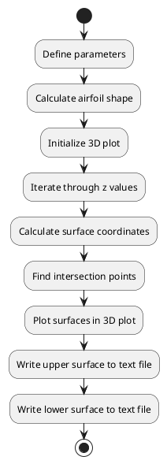

# Code Review: main

## Summary

The "main" code in the provided file is responsible for generating a 3D visualization and point cloud data for a modified NACA 4412 airfoil. The code uses mathematical equations and plotting functions to create the visualization and write the point cloud data to a text file.

## Parameters

The code defines and utilizes the following parameters:

- scaleX: The actual output scale in the X direction in mm.
- scaleY: The actual output scale in the Y direction in mm.
- scaleZ: The actual output scale in the Z direction in mm.
- M: The maximum camber of the NACA 4412 airfoil.
- P: The position of the maximum camber of the NACA 4412 airfoil.
- T: The maximum thickness of the NACA 4412 airfoil.
- a0, a1, a2, a3, a4: The coefficients used to calculate the airfoil shape.
- beta: The array of beta values used to calculate the airfoil shape.
- x: The array of x-coordinates of the airfoil shape.
- yc: The array of y-coordinates of the upper surface of the airfoil.
- dyc_dx: The array of slopes of the upper surface of the airfoil.

## Algorithm Implementation

The algorithm implemented in the code can be summarized as follows:

1. Define the necessary parameters.
2. Calculate the airfoil shape using the NACA 4412 equations.
3. Initialize a 3D plot and set the scale and limits.
4. Iterate through different z values.
5. Calculate the upper and lower surface coordinates of the airfoil at each z value.
6. Find the intersection points between the upper and lower surfaces.
7. Plot the upper and lower surfaces in the 3D plot.
8. Write the upper surface coordinates to a text file.
9. Write the lower surface coordinates to the same text file.

## UML Diagram

## Code Quality

The code is generally well-written and follows standardized variable naming conventions. The implementation of the algorithm is clear and easy to follow. However, there are a few areas that could be improved:

1. Magic numbers: The code uses some hardcoded numbers without clear explanations of their origins or meanings. It would be beneficial to add comments or variable names to make these numbers more understandable.
2. Lack of function encapsulation: The code could benefit from encapsulating some of the repetitive calculations and plotting into separate functions for better modularity and reusability.
3. File path handling: The code assumes a specific output directory path without checking if it already exists or handling potential errors. Adding proper error handling and flexibility in choosing the output directory would improve the code's robustness.

Overall, the code achieves its purpose effectively, but with some modifications and refactoring, it could be made more maintainable and extensible.